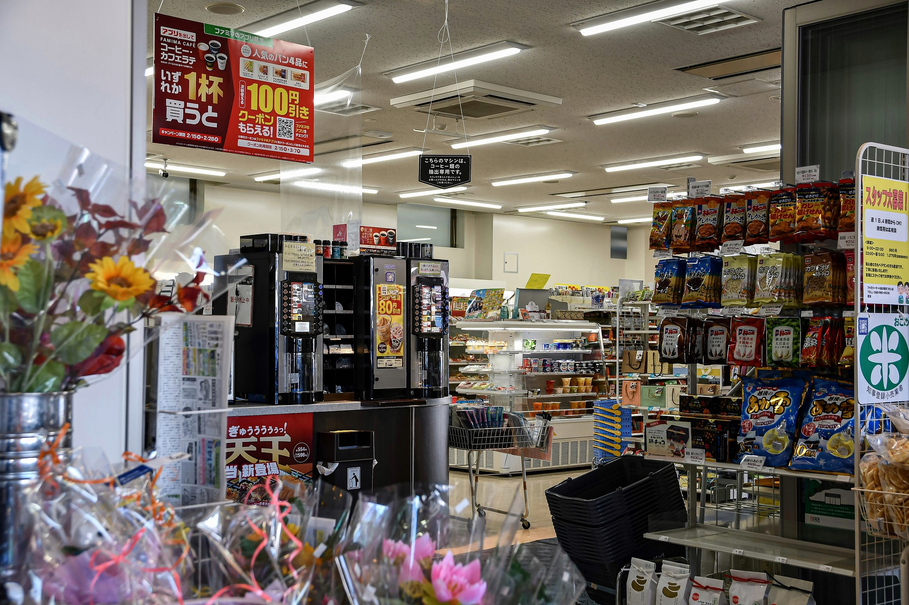
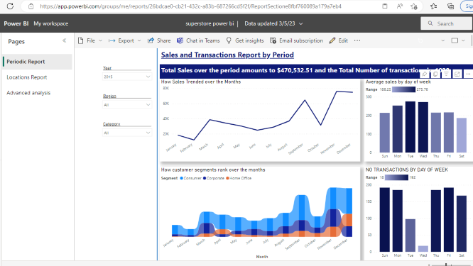
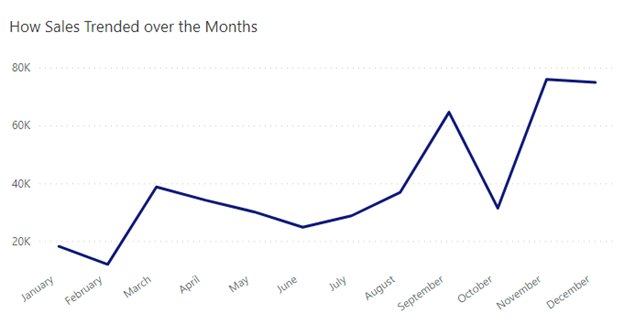
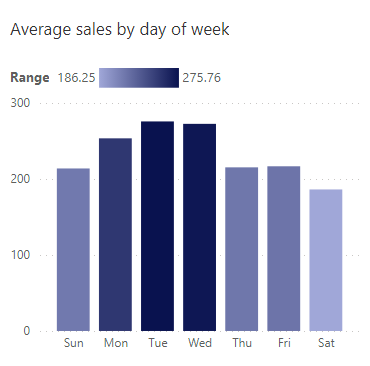
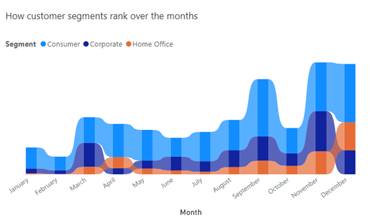
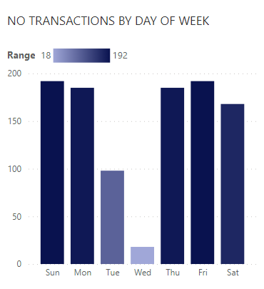

# Super Store Analysis

---
## Introduction
This is a power BI project on sales analysis of an imaginary store called **Super Stores**.
The project id to analyze and gain insights to answer important questions and help the store make data driven decisions.

**_Disclaimer_**: _All datasets and reports do not represent any company, store or organization. This is just a dummy dataset to demonstrate the capabilities of Power BI._

## Problem statement
1. How sales trended over the months and years.
2. Average sales by day of the week.
3. How customer segments rank over the months.
4. Top states by sales.
5. Bottom states by sales.
6. Sales distribution by city.
7. Key influencers.

To find answers to this questions, I divided the report into 3 parts: 
1. Periodic report for the days, months and years.
2. Locations report for the states and cities.
3. Advanced analysis for the key influencers.

## Skills/ Concepts demonstrated:
The following Power BI features were utilized:
- Bookmarking.
- Filters.
- Tooltips.
- Buttons.
- Powerquery.
- Page navigation.

## Data Source
The data was sourced from kaggle as a csv file. The data consists of only one table with 22 columns and 9994 rows. The column headers included information like Order ID, Ship date, Ship mode, customer ID, Customer name, segment, city, state among others. The dataset was based on a store in the United States of America.

## Data transformation

After loading the table to power query, I did some transformations on the data like:
1. Changed the data types of some of the columns
2. I removed the Country column since we know that it's only one country involved.
3. I removed the row ID column.

## Visualization

The report consists of 3 pages:
1. Periodic report
2. Location report
3. Advanced Analysis

You can interact with the report [here](https://app.powerbi.com/groups/7947a12e-20ef-4e63-80fd-f5f47d010fd3/reports/26bdcae0-cb21-432c-a83b-687266cd5f2f/ReportSectione8fbf760089a179a7eb4)

This is the dashboard to show how sales trended over time. It consists of a line chart to show sales trend over the months:

Stacked column chart to show average sales by day of the week

Ribbon chart to show how customer segments rank

Stacked column chart to show number of transactions by day of the week

